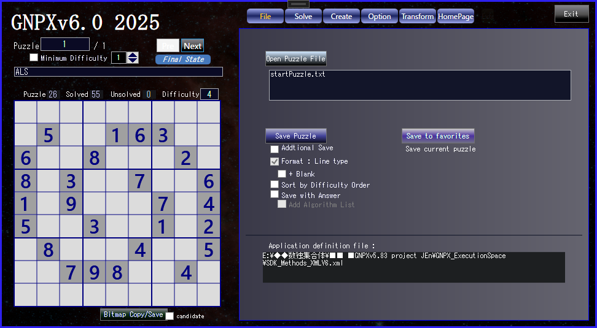

# Sudoku_Solver_Generator_v6.0
  Version6.0 2025.September will be released.

# GNPX v5 HP:
  en : https://gidoo-code.github.io/Sudoku_Solver_Generator_v6/ 
  jp : https://gidoo-code.github.io/Sudoku_Solver_Generator_v6_jp/ 
  

# Sudoku_Solver_Generator
 

## 1. GNPX v5 brings significant improvements to the program. 
   GNPX v6 is a development and deployment version of new algorithms. Smartness is secondary. 
   There is no continuity with the traditional code in the analysis algorithm part of GNPX. 

## 2. The Sudoku analysis algorithm was studied. 
   i will explain using an image diagram to explain the logic.(Too specific, it will be difficult to understand the essence)t 
  (1) "Locked" in Sudoku analysis 
  (2) Extension of ALS (AnLS), extension of algorithm 
  (3) Link、network expansion 
  (4) Fish family 
  (5) SueDeCoq family, SueDeCoq's new algorithm( SueDeCoqEx, Franken SueDeCoq, Finned SueDeCoq ) 
  (6) DeathBlossom algorithm consideration 
  (7) Subset 
  (8) Firework 
  (9) Exocet(junior/Senior) ... Senior Exocet is currently under development. 

## 3. GNPX v6 GNPXGNPX 
  (1) Classify and organize the processing contents using pages in the UI. 
  (2) Improve many analysis algorithms. All algorithms are expressed in bits (Bit81 changed to UInt128). 
  (3) Find solutions in the background and monitor the accuracy of the algorithm (using T/E method). 
  (4) Improve problem creation function (generate all Sudoku problems by specifying patterns and fixing block 1. Parallel processing. Approximately 9 million puzzles). 