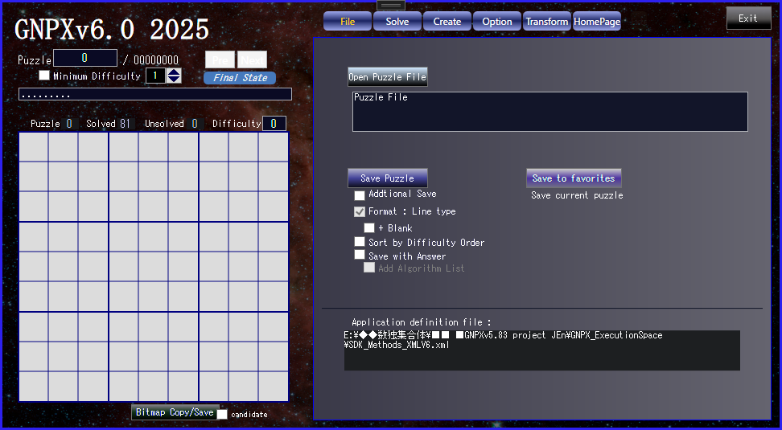
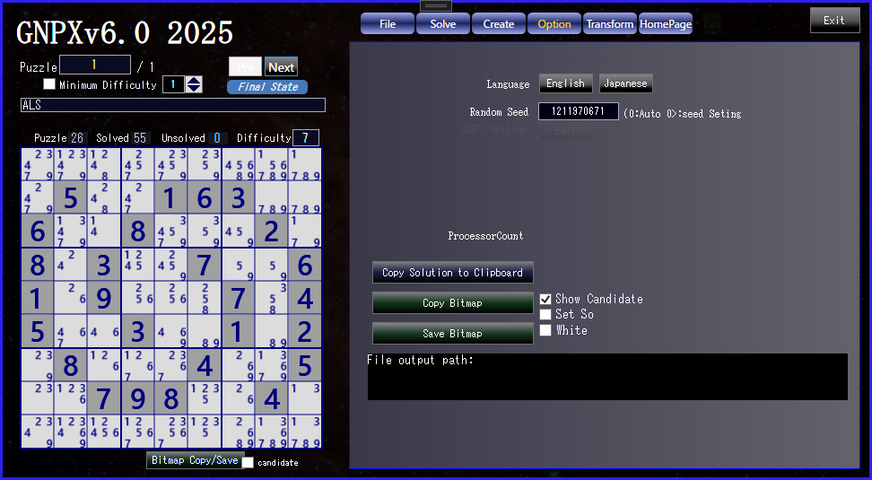

# GNPX Mannual
- The program is SUDOKU_App/GNPX.exe.
- SDK_Methods_XMLV6.xml is runtime definition data. It is generated and managed by GNPX.
Normally, users do not need to edit it. If it fails, just delete it. GNPX will handle the rest.
- When you compile a VisualStudio project, place GNPX.exe or a virtual machine in the SUDOKU_App folder.
- The Panel can be moved with the mouse(Response may be slow.)
<br><br><br>


# 0. First of all
　To get a feel for the overall operation, it is a good idea to do the following. <br><br>
(1) Click "File Input" <br>
- The file-selection-dialog will open, so open "GNPX_1_SAMPLE2_v6.txt".

<br>

(2) Click "Analyze(second button, turn orange). <br>
- The first time you start the application, the Method-selection-page will open.
If you click "Analyze" for the second time or later, this step will be skipped.<br>

<br>

(3) Click on “Analysis” on the second line.<br>
- A list of analysis methods will be displayed on the right (you can hide it by clicking the “M” to the right of the “Analysis” button)<br>
- “Analysis”: Solve one step of the puzzle<br>
- “Undo”: Go back one step of the puzzle<br>
- “Full Analysis”: Solve the puzzle to the end (see below)<br>
- “Reset”: Go back to the beginning of the puzzle<br>


<br><br><br><br><br>


# 1. File
## OpenPuzzle File
- Opens a Sudoku puzzle file. <br>
- The file format is text with spaces (0 or .) and digits(1-9), as shown below. <br>
- Spaces and line breaks are deleted when inputting before the reading process, so... it supports many formats. <br>
- Sudoku Data File sample. (see 'SUDOKU_App/GNPX_1_SAMPLE2.txt')
``` data file sample
023000800406080070780300502007008200060020700000650084602590400010004057005001020
032170608804009070750000000600008457200000006070400000300500084020900500400610702
000608300007004500600730428060000013004000600000300207518020030403006000296000700
.3.1.5.8...........8.....2...9.1.2...5.3.9.4..6.....7.7..6.1..851..7..69..8...7..
...3.9...3.......564.....89.........89..2..51..6.5.8..5.1...7.8.3.5.4.2.7..1.2..3
4....9.5.23..58.67...4.7.........3253.2....8.5.1...7.....89....9......7..1.72..46
```
<br>


<br><br>

## Save File
Save the Sudoku puzzle you entered or created to a file.
There are several options, such as overwriting/appending if the file exists, formatting, listing the solving method used, and adding difficulty level.

## Save to favorities
- Save the currently displayed Puzzle (difficult Puzzle, favorite Puzzle, etc.) to a file called SDK_Favorite.txt.
<br><br><br><br><br>


# 2. Solve
- Solves the currently displayed Puzzle. <br>
- When the program is first started, the "Method" selection page opens. This step is skipped when you click "Analyze" from the second time onwards. <br>
- Select the puzzle to analyze from the puzzle file. Select by "Pre(Previous)", "Next", or by entering the puzzle number. <br>
- You can specify the puzzle's dificulty to select a skip. <br>
In Solve, you can paste the puzzle number string on the left board to set the Puzzle. (Paste is not available in "File") <br>


<br><br><br><br>


## 2.1 Solve / Solve
### Solve / Undo / SolveUp / InitialState
- "Solve" : solves one step at a time. The same solution may confirm or remove multiple digits in multiple cells.
- 'Undo' : returns to the original step.
- "SolveUp" : solves to the end.
- "InitialState" : returns to the initial state. <br>
- "Final State" : The final state of the Puzzle(no Sudoku solving algorithm is used to determine this).

The upper shows the name of the applied algorithm and its details. <br>
The lower shows the algorithm applied in the steps up to this point and the number of times it was applied. <br>
If there is more information than can fit in the upper column, a separate information window will open. <br>


<br><br><br><br>


## 2.2 Solve / MultiSolve
### MultiSolve / |< / <
- Find possible algorithms for one position. The number of algorithms you can find is limited by the algorithm level, number of types, and time.
- When you select a possible algorithm, a detailed explanation will be displayed in the box above.
  In addition, the left image will show the candidate digit that were confirmed or excluded by that algorithm.
- When you select the algorithm you found and click MultiSolve, you will move on to the next position from that result.
- Click '<' to return to the previous state. The algorithm list will also return to the previous state.
- Click '|<' to return to the initial state. <br>


<br><br><br><br>


## 2.3 Solve / Method
### Method and Order
- The algorithm for solving Sudoku can be specified in two ways: "Difficulty" and "Recommend".
("Recommend" can be changed as desired by rewriting the program.)
- You can specify whether to enable or disable the algorithm.
- You can specify the order in which they are applied.
- The system saves the specification and order here in a definition file.
- The "Single" algorithm is always enabled, and the order cannot be changed.
- The order of the algorithm "GeneralLogic" is fixed. Since it is a universal algorithm that includes all algorithms, when it is enabled, other algorithms are not applied. For more information on "GeneralLogic", please see HP.
- 'GeneralLogic' is enabled/disabled in 'Solve/MethodOption'. <br>


<br><br><br><br>


## 2.4 Solve / MethodOption
 - ALS / Max.Size: The maximum size of the ALS (Almost Locked Set) used in the algorithm.
- NiceLoop / Max.Size: The maximum size of the (Grouped) NiceLoop used in the algorithm.
- Link type: You can specify the type to include in the eNetwork.
- Force Chain /
- Specify how to find the solution for Force_Chain. You can specify only one/only one digit (or cell)/all.
- General Logic /
- GeneralLogic is an algorithm that includes all solution algorithms, so specify whether to apply it or not.
- The size of GeneralLogic is the size of Baseset Size, and specify its maximum value.
- Rank = (Converset Size) - (Baseset Size).<br>


<br><br><br><br>


# 3. Create

## 3.1 Create / Manual
- Manually create a Sudoku puzzle in the 9x9 squares on the left.
- First, strongly imagine the digit you want to input in your mind.
- Click the position in the 9x9 square where you want to input the digit, and the digit you imagined will appear in the specified position.
If a digit different from the one you imagined appears, it is because your imagination was weak. In that case, strongly imagine it again and click. You can try this as many times as you like.
- To cancel a digit you have already input, strongly think to yourself "disappear" and click the digit again.
- New, Copy, Clear, Delete are just what they say.
- A string of 81 digits(spaces are 0 or .) can be pasted into the image on the left.
Spaces and line breaks in the string are deleted, so it can be used in a variety of formats. <br>


<br><br><br>


## 3.2 Create / Auto
- First, set the Sudoku pattern.
- Specify symmetrical patterns (2 types of point symmetry, 4 types of line symmetry) and asymmetrical patterns.
- Click 'Pattern' to generate a random pattern.
- Specify the number of cells in 'Minimum'.
- Edit the generated pattern by clicking on the cells. At this time, the symmetrical pattern specification is activated.
- Click 'Pattern Capture' to capture the Sudoku pattern displayed on the left.
- Click 'Generate Puzzle' to generate a Sudoku puzzle.
- The generation time varies greatly depending on the specified pattern shape, number of patterns, and difficulty level of the Sudoku.
- Specify randomization of numbers when generating.
- Some information is displayed when generating.<br>


<br><br><br>

## 3.3 Create / All Puzzle
- Generates all Sudoku puzzles of the specified pattern. The digit sequence in block 1 is fixed.
- First, set the Sudoku pattern. (Same as "Auto")
- Since the time required for generation depends on the environment, perform a test generation. Specify the ratio. This will give you an approximate idea of ​​the generation time.
Unfortunately, it won't take as long as you think.
- The generated puzzles are saved in the folder "AutoGen_Puzzles". <br>
The first 10,000 puzzles will be stored within GNPX.


<br><br><br>


# 4. Option
- Depending on the execution environment, the program will be displayed in Japanese or English. You can change it by selecting the button.
- Specifies the initial value of the random number used by the system. '0' automatically sets the initial value randomly.
- Copies the Sudoku bitmap shown on the left to a buffer or saves it to a folder.
- When saving, the folder name is fixed, and the saved file name is automatically generated.
- There are several options.


<br><br><br>


# 5 Transpose
## 5.1 Transpose/Transpose
Changes the appearance of the Sudoku puzzle. This does not change the essence of the Sudoku puzzle.
- Changes the digits displayed.
- Clicking cells in the Sudoku puzzle will change the digits in the order you clicked. You can also change already changed parts (it will be processed to avoid inconsistencies).
- You can also make random changes.
- You can change the row order, column order, and symmetrical transformation of matrices.
- The middle row is a transformation that maintains symmetry, and the bottom row is a transformation that does not preserve symmetry.
- The numbers next to the buttons in the bottom row are the number of times each transformation method has been performed. 0 is the initial state.
- Click 'Save' to save the converted puzzle (saving within the system, saving to an external file is required separately).


<br><br><br>


## 5.1 Transpose/Standardization
Converts Sudoku puzzles to standard form.
- No matter how you change the appearance, there is only one standard form.
- The definition of standard form and how to find it are explained on the website.
- Instructions for converting to standard form are always shown in the box.
- When converting to standard form, digits conversions and row/column/object conversions can be coded.
- Even when converting Sudoku Puzzle, the standard form is unique and can be expressed in code.<br>
(You can literally sequence any Sudoku puzzle by following these steps.)
<br>


<br><br><br>

# 6 Homepage
Jump to HP from the application.<br>


<br><br><br>